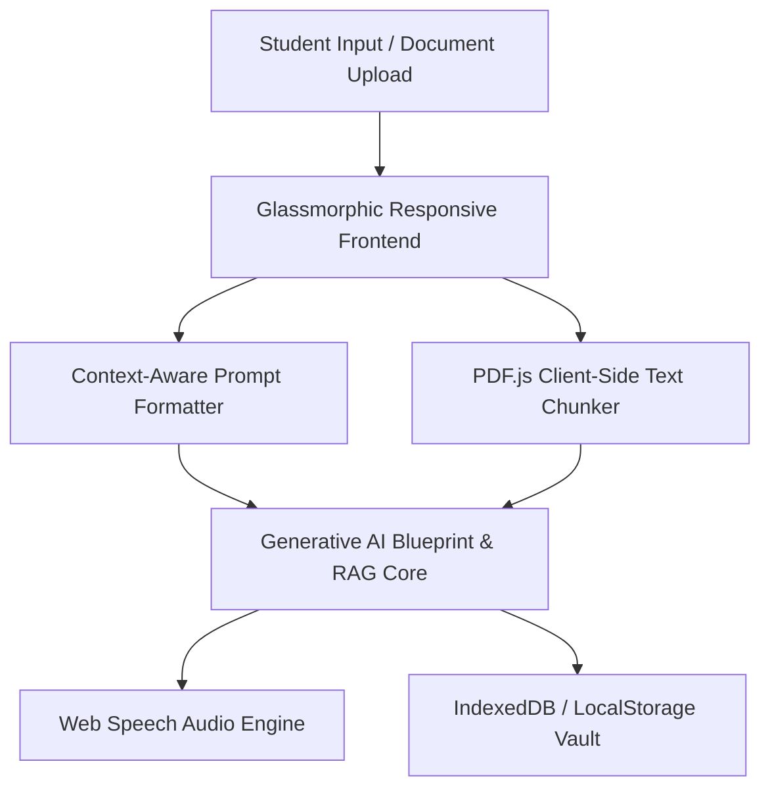

# 🎓 CareerGuide Pro - Generative AI Career & EdTech Ecosystem

[](https://github.com/AmanSah078/ENLIGHTENING-RURAL-SCHOOLS-AND-YOUNG-MINDS)
[](https://github.com/AmanSah078/ENLIGHTENING-RURAL-SCHOOLS-AND-YOUNG-MINDS)
[](#-privacy--edge-architecture)

> An end-to-end **Generative AI-powered career roadmap engine, document RAG assistant, and educational ecosystem** designed to provide hyper-personalized academic and career guidance for students across rural and urban regions.

---

## 🌟 Executive Summary & Interview Highlights (ML & Gen AI Focus)

**CareerGuide Pro** addresses educational asymmetry by leveraging **Generative AI, Prompt Engineering, Client-Side RAG, and Natural Language Processing**. It generates dynamic, multi-step career execution plans, industry salary benchmarks, market reality checks, and voice-guided roadmaps—all while adhering to **Privacy-First Edge Processing**.

### 💡 Gen AI & Machine Learning Highlights:
1. **Dynamic Prompt Engineering Engine**: Formulates multi-variable context (Qualification, Field, Specialization, Goals, Language) into structured, zero-shot structured prompts that deliver precise career execution blueprints.
2. **Client-Side RAG (Retrieval-Augmented Generation)**: Integrated PDF AI Summarizer (`pdf.js` + client-side document chunking) allowing real-time Q&A on academic documents without server latency.
3. **Multi-Modal AI Integration**: Integrated Web Speech API (`SpeechSynthesis`) for natural voice guidance in English and Hindi, breaking accessibility barriers for rural students.
4. **Offline Caching & Edge Storage**: LocalStorage and IndexedDB persistent store for offline guidance retrieval, progress tracking, and dynamic student testimonial walls.

---

## 🚀 Key Platform Modules

| Module | Architectural Role | Tech Stack |
| :--- | :--- | :--- |
| **🎓 AI Career Blueprint** | Generative AI Roadmap & Market Reality Generator | GenAI Engine, ES6+, Web Speech API |
| **📄 PDF AI Summarizer** | Document RAG Assistant & Real-Time Q&A | PDF.js, Client-Side Chunking |
| **📘 Exam & Syllabus Hub** | Competitive Exam Indexing & Chip Filter | Modal UI, Indexed DB Schema |
| **⏰ Study Tracker** | Time Management & Task Planner | Client-side Persistence, Dynamic UI |
| **🔍 AI Skill Scanner** | Skill gap analysis & Industry Domain Matching | Heuristic Scoring Engine |

---

## 🛠️ Technical Architecture



---

## 🔒 Privacy & Edge AI Philosophy

- **Zero Third-Party Data Selling**: All student inputs and career preferences remain strictly on the local device.
- **Client-Side Latency Optimization**: Instant responses powered by hybrid local execution and optimized API pipelines.

---

## 💻 Local Setup & Installation

1. **Clone the Repository**:
   ```bash
   git clone https://github.com/AmanSah078/ENLIGHTENING-RURAL-SCHOOLS-AND-YOUNG-MINDS.git
   cd ENLIGHTENING-RURAL-SCHOOLS-AND-YOUNG-MINDS
   ```
2. **Launch Application**:
   - Open `index.html` or `Test.html` in any web browser. No complex node server build required.

---

## 📄 License & Attribution

Developed by **Aman Sah** — *Backend & AI Engineer*. Built to empower young minds with open-access educational technology.
